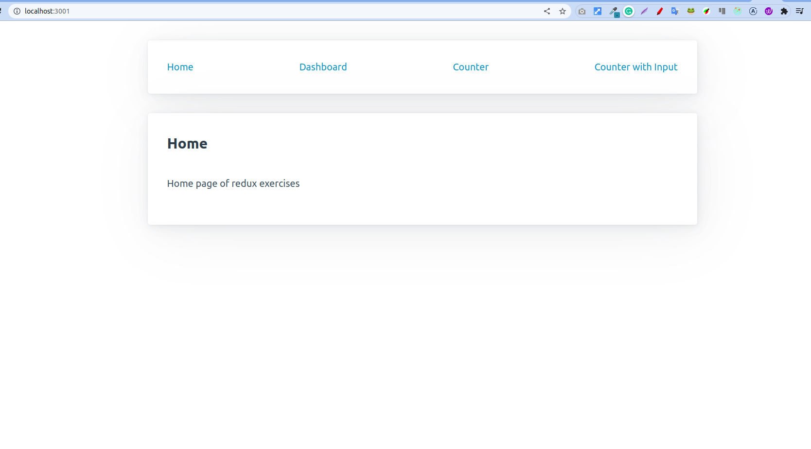
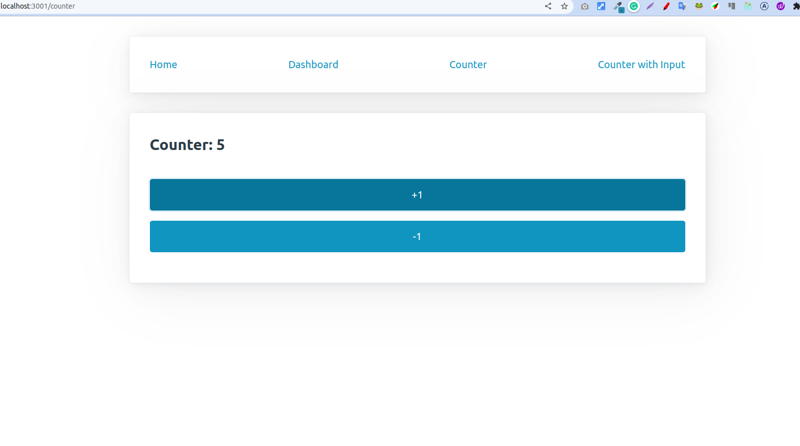

# Aplikacja treningowa do przećwiczenia react, redux oraz react-router-dom

Aplikacja składająca się z 4 podstron

1. Home - wyświetlająca conent statyczny
2. Dashboard - wyświetlający wartości dwóch counterów z dwóch różnych podstron
3. Counter - podstawowy counter obługiwany przez reduxa
4. Counter with Input - counter zawierający input który pozwala określić o ile user może
   zwiększyć/zmniejszyć wartość countera - stan jest trzymany w redux

## Aplikacja do podglądu

Żeby sprawdzić i przeklikać zachowanie aplikacji można to zrobić pod tym linkiem

https://react-redux-react-router.surge.sh/

## Zadanie

Twoim zadaniem jest stworzenie aplikacji reactowej na podstawie designów dostepnych w plikach ".png", głównym celem zadania jest wykorzystanie reduxa (stowrzenie 2 różnych sliców, stora i połączenie tego stora z apką reactową).

Możesz wykonać zadanie samemu posiłkując się przykładami i kodem z zajęć albo wykonać następujące kroki:

1. setup aplikacji reacotwej - wywołaj poniższą komende w terminalu w folderze w którym chcesz żeby ten projekt się znalazł

```
npx create-react-app nazwa_apki
```

2. następnym elementem jest zainstalowanie niezbędnych paczek potrzebnych do wykonania zadania: react-router-dom react-redux @reduxjs/toolkit

żeby zainstalować w/w paczki należy wywołać poniższą komende w folderze z projektem

```
npm install @reduxjs/toolkit react-redux react-router-dom
```

3. dodatkowo żeby zachować style takie jak są użyte w designach oraz w modelowym rozwiązaniu należy pobrać paczke pico/css - możesz ją zainstalować wywołując komende poniżej

```
npm install @picocss/pico
```

4. Setup reac-router-dom-u - w pliku index.js zaimportuj komponent BrowserRouter z paczki 'react-router-dom' i otocz nim komponent <App/> tj. poniżej

```
    <BrowserRouter>
        <App />
    </BrowserRouter>
```

5. Setup reduxa - w pliku index.js zaimportuj komponent Provider
   i otocz nim komponent <App/> tj. poniżej

```
    <BrowserRouter>
      <Provider store={store}>
        <App />
      </Provider>
    </BrowserRouter>
```

zauważ że komponent Provider przyjmuje propsa store do którego trzeba przypisać obiekt store który za chwile stworzymy

6. Tworzenie stora - stwórz folder store a w nim plik store.js - w tym pliku
   będzie utworzony i wyexportowany store.
   Żeby stworzyć store należy zaimportować funckje configureStore z paczki @reduxjs/toolkit
   funkcja ta przyjmuje obiekt konfiguracyjny w którym trzeba określić pole reducer - jako warosć dla tego klucza na razie możesz użyć pustego obiektu tj poniżej

```
export const store = configureStore({
  reducer: {
  },
});
```

7. Ciąg dalszy setupu reduxa - przejdź do pliku index.js i zaimportuj store z folderu store z pliku store.js - ten store należy przypisać jako wartość w propsie props w komponencie Provider tj poniżej

```
    <BrowserRouter>
      <Provider store={store}>
        <App />
      </Provider>
    </BrowserRouter>
```

8. Dołączenie styli z paczki pico/css - żeby nasza aplikacja wyglądała zgodnie z designami
   należy zaimportować w pliku index.js style z pobranej paczki - osiągniemy to importując tj poniżej

```
import "@picocss/pico";
```

9. Tworzenie podstawowej struktury aplikacji w pliku App.js w komponencie App

- stworzenie głównego kontenera na apkę - użycie tagu main z klasą container - dzięki temu pico css przesunie na środek kontent naszej strony oraz ograniczy jego szerokość
- stworzenie nawigacji - tagi article do pogrupowania elementów nawigacyjnych oraz
  dodanie styli (tag article dzięki pico css jest ostylowany automatycznie),
  dodanie tagu nav (semantyczny tag HTMLowy mówiący że w środku będą linki),
  dodanie komponentów Link który pochodzi z paczki react-router-dom
  komponent Link wymaga określenie propsa to czyli segmentu/ścieżki na jaką ma przekierować po kliknięciu

- zauważ że przykład przedstawia tylko dwa linki dlatego należy uzupenić nawigacje o brakujące linki zgodnie z designem

```
export const App = () => {
  return (
    <main className="container">
      <article>
        <nav>
          <Link to="/">Home</Link>
          <Link to="/dashboard">Dashboard</Link>
        </nav>
      </article>
    </main>
  );
};
```

- stowrznie route-ów dla poszczególnych komponentów
  użcie komponentów Routes oraz Route pochodzących z paczki react-router-dom - zauważ że komponent Routes jest parentem dla komponentów Route. Komponent Route przyjmuje conajmniej dwa propsy 1-path określający ścieżkę/segment url detykowany komponentowi określonemu w propsie 2-element. Props element przyjmuje komponent reactowy adekwatny do tego co chcemy wyświetlić w danej podstronie.

  ps1. Zwróć uwagę że Route-ów jest tylko dwa a podstron na designie jest 4 - uzupełnij brakujące Route-y.
  ps2. Zwróć uwagę że w propsach element={} są określone komponenty których jeszcze nie ma - stworzymy i zaimportujemy je w dalszej części

```
export const App = () => {
  return (
    <main className="container">
      <article>
        <nav>
          <Link to="/">Home</Link>
          <Link to="/dashboard">Dashboard</Link>
        </nav>
      </article>

      <Routes>
        <Route path="/" element={<Home />} />
        <Route path="dashboard" element={<Dashboard />} />
      </Routes>
    </main>
  );
};
```

10. Implementajca komponentów - zakoduj komponenty zgodnie z designem
    następnie zaimportuj je do pliku App.js i przypisz każdy do odpowiedniego Route.

11. Stwórz slice-y poszczególnym komponentom - na przykładzie komponentu Counter.js
    w folderze z komponentem (Counter) stwórz plik który będzie zawierał plik couterSlice.js
    niech ten plik importuje funckje createSlice z paczki @reduxjs/toolkit

funkcje tą należy wywołać a rezultat przypisać do zmiennej
funkcja ta przyjmuje jako argument obiekt konfuguracyjny w którym trzeba określić kilka kluczy i wartości tj poniżej

```
import { createSlice } from "@reduxjs/toolkit";

const counterSlice = createSlice({
  name: // unikatowa nazwa slica,
  initialState: { // wartość początkowa stanu},
  reducers: {
     // funkcje które określają co ma się stać ze stanem po zdipsatchowaniu akcji o takej
     // samej nazwie co klucz
  },
});
```

12. Export akcji oraz reducera

Następnym elementem jest export w/w - po to żeby inne części aplikacji mogły
to zaimportować i tego użyć

```

const counterSlice = createSlice({
/* TUTAJ JEST TWOJA KONFIGURACJA */
});

export const { /* tutaj są akcje które chcesz wyeksportować */ } = counterSlice.actions;

export default counterSlice.reducer

```

13. import i użycie reducera w pliku store.js

wyeksportowany defaultowo reducer w pkt. 12 należy zaimportować w pliku store.js
i użyć w obiekcie reducer w argumencie configureStore

```
import counterDowolnaNazwaBoToDefault from "../components/Counter/counterSlice";

export const store = configureStore({
  reducer: {
    counter: counterDowolnaNazwaBoToDefault,
  },
});

```

14. Komponent Counter i dipsatchowanie akcji, komponent counter żeby zaktualizować stan countera musi wysłać sygnał do stora z informacją co ma się stać z naszym stanem - czyli w języku reduxowym - trzeba zdipsatchować odpowiednią akcję żeby to zrobić należy na początku
    "pozyskać" dostęp do funkcji która może dispatchowac takie akcje ta funkcja to useDispatch
    która pochodzi z paczki react-redux

```
import React from "react";
import { useDispatch } from "react-redux";

export const Counter = () => {
  const dispatch = useDispatch();

  return (
    <article>

    </article>
  );
};

```

- jak użyć dispatcha + cząstkowa implementacja komponentu Counter.
  Żeby użyć funkji dispatch musimy okreslić moment w którym ma to się stać - klknięcie przycisku - czyli na onClicku przypisujemy funkcje która wywołuje funckje dispatch a jako argument przekazujemy akcje/wywołanie akcje jaka ma sie wykonać (to ona infrmuje który reducer ma się wykonać w slice i jaki kawałek kodu ma wpłynąć na nasz stan),

akcja w naszym przypadku "decrease" jest to akcja która została wyeksportowana z pliku counterSlice.js patrz podpunkt 12 a konretnie

```
export const { /* tutaj są akcje które chcesz wyeksportować */ } = counterSlice.actions;
```

```
import React from "react";
import { useDispatch} from "react-redux";
import { decrease} from "./counterSlice";

export const Counter = () => {
  const dispatch = useDispatch();

  return (
    <article>
      <button
        onClick={() => {
          dispatch(decrease());
        }}
      >
        -1
      </button>
    </article>
  );
};

```

15. Wyświetlanie danych oraz selektory
    Żeby wyświetlić dane z naszego stanu musimy się do nich jakoś dostać/ jakoś je wyciągnąć ze stanu tak żeby można było tego użyć w naszym komponencie

do tego celu posłużą nam tzw seletory oraz hook useSelector

dzięki temu duetowi możemy wyciągnąć dowolny kawałek stanu w dowolnym miejscu w naszej aplikacji

ps1. zwróć uwagę że selektor to nic innego jak funckja którą przekazujemy jako argument do hooka useSeletor - ta funckja ma dostęp do naszego całego stanu i możemy wyciągnąć co chcemy
ps2. zwróć uwagę że zotało tam użyte słowo "słowoJakieZOstałoUżyteJakoKluczWSlicie" jest to nic innego jak nazwa klucza w którym trzymana jest wartośc naszego countera
ps3. selector można też stworzyć w pliku ze slicem i zaimportować do tutaj i użyć go tak jak jest to proponowane w następnym przykładzie

```
import React from "react";
import { useDispatch, useSelector } from "react-redux";
import { decrease } from "./counterSlice";

export const Counter = () => {
  const counter = useSelector((state)=>state.counter.słowoJakieZOstałoUżyteJakoKluczWSlicie);
  const dispatch = useDispatch();

  return (
    <article>
      <h3>Counter: {counter}</h3>
      <button
        onClick={() => {
          dispatch(decrease());
        }}
      >
        -1
      </button>
    </article>
  );
};

```

counterSlice.js

```
import { createSlice } from "@reduxjs/toolkit";

export const counterSlice = createSlice({
  name: "counter",
  initialState: {},
  reducers: {},
});

export const selectCounterValue = (state) => state.counter.value;

export const { decrease, increase } = counterSlice.actions;

export default counterSlice.reducer;
```

Counter.js

```
import React from "react";
import { useDispatch, useSelector } from "react-redux";
import { decrease, selectCounterValue } from "./counterSlice";

export const Counter = () => {
  const counter = useSelector(selectCounterValue);
  const dispatch = useDispatch();

  return (
    <article>
      <h3>Counter: {counter}</h3>
      <button
        onClick={() => {
          dispatch(decrease());
        }}
      >
        -1
      </button>
    </article>
  );
};

```

16. Pozostałe ekrany

- CounterWithInput - powinien mieć możliwość określenia wartości jaką chcemy ustawić tzn
  obsługa inputu powinna być zrbiona za pomocą useState ale sam counter powinien być obsłużony za pomocą reduxa - jedyna różnica polega na tym że tym razem akcje będą przyjmowały argument a ten argument to jest tzw payload który chcemy wykorzystać do podniesienia/obniżenia wartości countera

- Dashboard ekran który tylko "konsumuje" stan tzn użuwa seletorów + useSeletor żeby wyciągnąć wartości counterów i je wyświetlić

17. Te flow pozwoli na stworzenie jednej części aplikacji następne należy stworzyć na tej samej zasadzie. W razie potrzeby możesz skorzystać z rozwiązania któro jest dostępne w repozytorium.

## Designy







